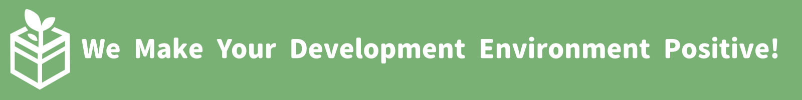
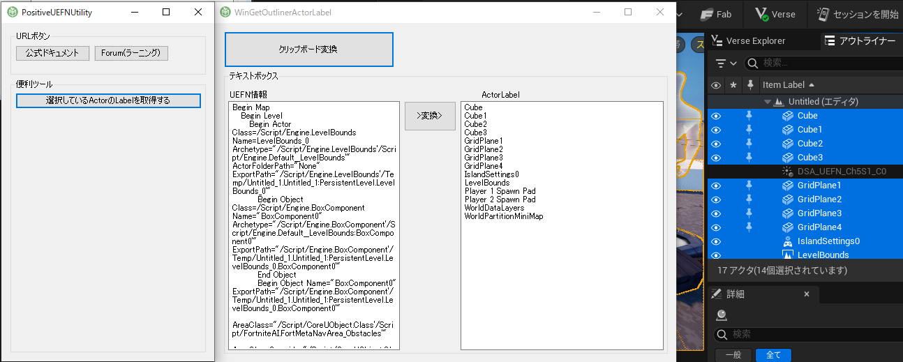
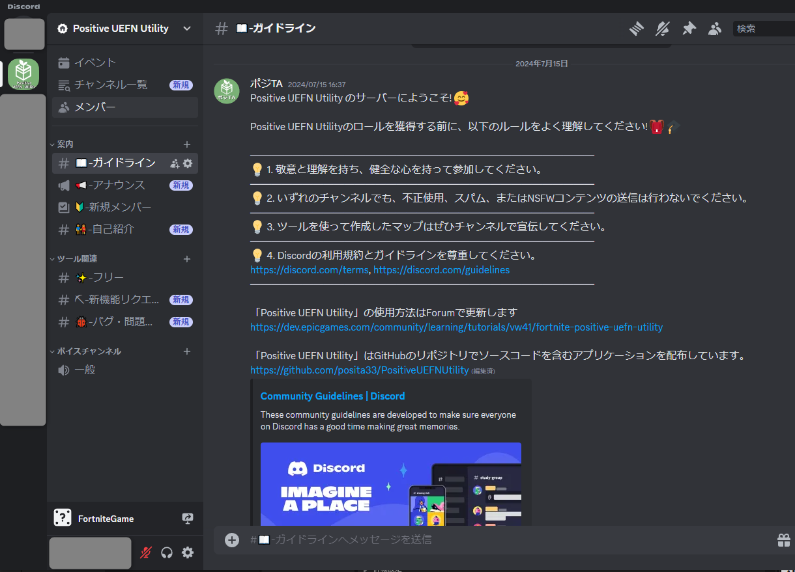
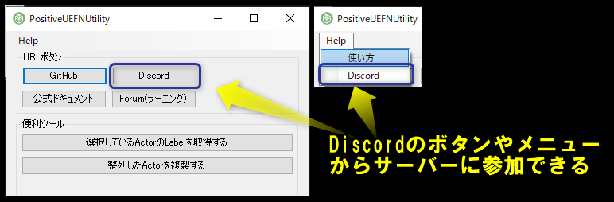

# Positive UEFN Utility

UEFNではEditor Utility Widgetが使用できません。UEFNから取得できるテキスト情報を利用したツールを作成しました。

## 「.NET Framework 4.7.2ランタイム」をインストール

「Positive UEFN Utility」は「.NET Framework 4.7.2」で開発しています。
「.NET Framework 4.7.2」がインストールされていないと起動しません。「.NET Framework 4.7.2ランタイム」をインストールしてください。

[.NET Framework 4.7.2 のダウンロード](https://dotnet.microsoft.com/ja-jp/download/dotnet-framework/net472)

## 使用方法はEpicのForumページを確認する

Forumに使用方法ページを作成しました。
使用方法ページを随時更新します。

[ForumのPositive UEFN Utilityの使用方法ページ](https://dev.epicgames.com/community/learning/tutorials/vw41/fortnite-positive-uefn-utility)

## Discordサーバーを開設

対応Version : 0.2.0

[Discord](https://discord.gg/WHv8egZnhy)でも「新機能リクエスト」・「バグ・問題報告」をできるようにしました。

サーバーに入ったら「ガイドライン」チャンネルを確認してください。

Discordサーバにはツールから参加できます。

